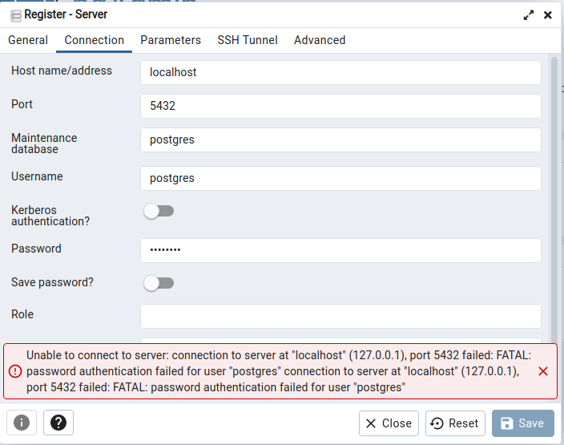

# Postgres

### Problem 1
Unable to connect to server



case: Forgot password (OS-Ubuntu 22.04, PGAdmin4, Postgresql v15)

solution: 
```
cd /etc/postgresql/15/main
```
```
sudo -u postgres psql
```
```
#By default username is postgres
\password postgres
```
Enter your new password two times. `exit` for close it.
